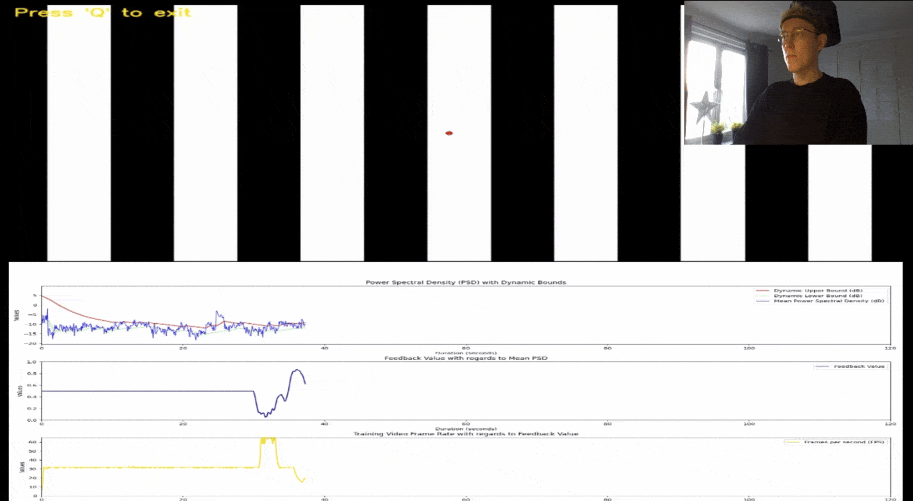
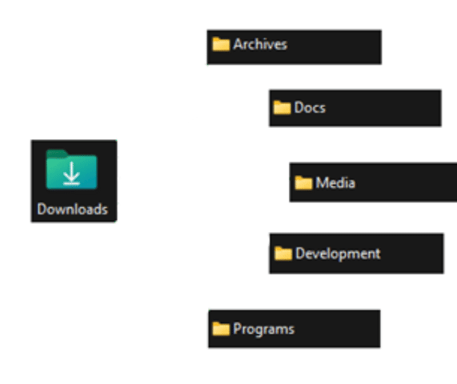

## "_Hello there_" - Obi-Wan Kenobi

- 👨‍💻 Currently trying my patience and luck with:
    - "Paddlingen"-website to handle booking & payment for a recurring yearly event, done together with https://github.com/matsnord94
    - 
- 🌱 I’m currently studying:
    - AI/ML Engineer track on Datacamp
    - Microsoft’s Azure Fundamentals certification (AZ-900)
- 🔭 Upcoming project ideas:
    - TBD

# 💻 Tech Stack

### Languages & Frontend

### Backend & Data

### DevOps, Deployment & Tools

    
# 🎬 **Project demos**

## [Paddlingen](https://paddlingen.se)

  
   
  Paddlingen is a Flask-based booking website for a recurring Swedish canoe event.
      It is built with Python, Flask, Jinja, HTML, CSS, JavaScript, PostgreSQL/Supabase, Alembic, Gunicorn, and Docker. Deployed on a Hetzner VPS through Self-hosted Coolify under the domain paddlingen.se.

## [GymTracker](https://github.com/Marcus-Gustafsson/GymTracker)

  <!-- Store the GIF in your profile repo at assets/gymtracker.gif -->
  
   
  GymTracker is a web-based application, developed as part of a university project, that uses pre-trained TensorFlow.js pose detection models to track your movements and help optimize your workouts.

## [NFB-Training](https://github.com/Marcus-Gustafsson/NFB-Training)

  
   
  This project is part of a degree project with a focus on neurofeedback training (NFB) for post-Concussion Syndrome (PCS) patients using the Muse 2 portable EEG headband.

    
## [AutoSort](https://github.com/Marcus-Gustafsson/AutoSort)

    

  
   
  Personal software/project to help me sort and store my downloaded files

